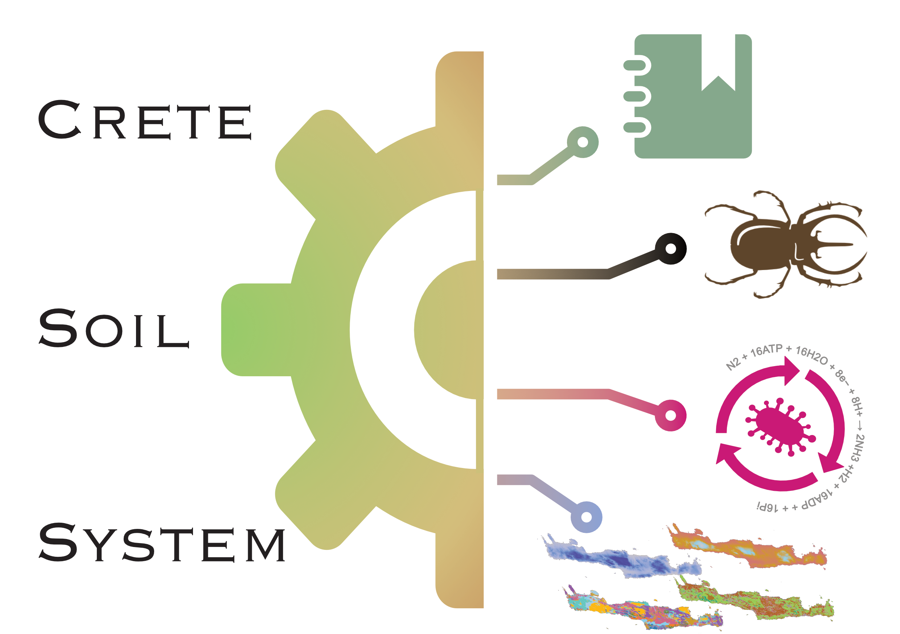

*Beetle icon is created by Nicko Studio, Noun Project.*

# Crete data integration

This repository aims to bring together biodiversity knowledge regarding 
the island of Crete, Greece. Crete has been studied extensively for more 
than three centures. This has resulted in a wealth of knownledge available 
in the forms of :

* Literature. Contemporary - PubMed, Google Scholar, Dimensions and historical - Biodiversity Heriatage Library),

* Biodiversity. Species occurrences and metadata in public databases (GBIF, IUCN) and sequences from environmental DNA studies (e.g ENA, Mgnify)

* Spatial data. Remote sensing and manual maps (e.g Copernicus, ESDAC, WorldClim)

More specificaly, the focus is on the soil ecosystems of Crete.
Soils are consindered the cornerstones of terrestrial functioning and with 
the digital representation of ecosystems the aim is to explore new 
types of associations and generate new hypotheses. The integration of biodiversity knowledge in one place is a longstanding
goal in ecological research. The synthesis of multiple data types and datasets across the globe has enabled 

## Literature

### BHL

Historical literature of Crete's biodiversity.

```
wget http://www.biodiversitylibrary.org/data/data.zip
```
From the schema and the BHL data model we perform searches on Title, Items and Subjects. Items are the bound objects of BHL, so a title can have multiple items. The digitised document is the item. Additionaly, each title is assigned with subjects. The are not standardised. Each Item also has a pages table with information per page.

In the BHL schema it is noted that :

NOTE: This export DOES NOT include all of the pages in the BHL database. It only contains pages on which taxonomic names have been identified.

There is an archive from BHL that contains all OCR text [here](https://smithsonian.figshare.com/articles/dataset/BHL_Optical_Character_Recognition_OCR_-_Full_Text_Export_new_/21422193/12).
It is about 40gb tarball. Unziped is 300 gb and contains 62 million ocred pages of 292 thousand different documents.

```
find . -name "*.txt" | gawk -F"/" 'BEGIN{print "folder" "\t" "items" "\t" "pages"}{folder[$2][$3]++}END{for (f in folder){ for (i in folder[f]){print f "\t" i "\t" folder[f][i]}}}' > ~/crete-data-integration/bhl_ocr_summary.tsv

gawk -F"\t" '(NR>1){sum+=$3}END{print sum}' bhl_ocr_summary.tsv
```

Information regarding Crete can be mentioned inside the pages of the documents. 
The title and summaries provided from BHL don't necessarely contain such 
information. For that reason, search in all pages must be performed.

Crete can be mentioned as Crete , Kriti, Kreta etc, hence the search must 
include those as well.

```
find . -name "*.txt" | xargs gawk '{if (tolower($0) ~ /\<kreta\>/){print FILENAME "\t" $0}}' > ~/crete-data-integration/bhl_pages_kreta.tsv
find . -name "*.txt" | xargs gawk '{if (tolower($0) ~ /\<crete\>/){print FILENAME "\t" $0}}' > ~/crete-data-integration/bhl_pages_crete.tsv
find . -name "*.txt" | xargs gawk '{if (tolower($0) ~ /\<kriti\>/){print FILENAME "\t" $0}}' > ~/crete-data-integration/bhl_pages_kriti.tsv
find . -name "*.txt" | xargs gawk '{if (tolower($0) ~ /\<cretan\>/){print FILENAME "\t" $0}}' > ~/crete-data-integration/bhl_pages_cretan.tsv

```

The `\<` and `\>` are to define the word boundaries in awk. 

To dig in at the results first collate the files:

```
cat bhl_pages_cretan.tsv bhl_pages_crete.tsv bhl_pages_kreta.tsv bhl_pages_kriti.tsv > bhl_pages_all_keywords_crete.tsv
```

```
gawk -F"\t" '{split($1,id, "/"); items[id[3]]++ ; pages[id[4]]=1}END{print length(items) FS length(pages)}' bhl_pages_all_keywords_crete.tsv
```

Looking at the distribution of pages per item (document) is important to decide filtering.

```
gawk -F"\t" '{split($1,id, "/"); items[id[3]]++ ; pages[id[4]]=1}END{for (i in items) {print i FS items[i]}}' bhl_pages_all_keywords_crete.tsv | sort -k 2 -h | cut -f 2 | uniq -c

```
documents n pages
16936 1    
5345 2     
2270 3     
1261 4 

Hence 25812 documents contain less that 5 mentions of keywords, conversely there
are 3696 documents with 5 or more mentions of Crete keywords.

The following oneliner counts the number of pages per item and filters all items
and pages for the items that have less than 5 hits. They are saved to a new file
itemid PageID columns. 
This filtering leads to 35130 pages.

```
gawk -F"\t" '{split($1,id, "/"); items[id[3]]++ ; pages[id[4]]=1}END{for (i in items) {if (items[i]>4){item_s[i]=1}}; for (p in pages){split(p,p_s,"-"); if (p_s[1] in item_s){print p_s[1] FS p_s[2]}} }' bhl_pages_all_keywords_crete.tsv | sort | uniq > bhl_item_page_filtered.tsv
```

Are there taxon names identified in these pages? 

```
gawk -F"\t" 'FNR==NR{a[$2]=$1;next} ($3 in a) {print $2,a[$3],$3}' bhl_item_page_filtered.tsv ../../data/bhl_data/pagename.txt > bhl_item_page_taxa.tsv
```

There are 23391 pages with taxa names in 3000 items. The total distinct taxa names
in these pages are 75405. The occurrences of taxa in pages are 214215. 

These items are published in journals or monographs that BHL mentions as titles.

```
gawk -F"\t" '(ARGIND==1){items[$1]=1}(NR>1 && ARGIND==2){title[$1]=$0}(NR>1 && ARGIND==3 && $1 in items){print $1 FS title[$2]}' bhl_item_page_filtered.tsv ../../data/bhl_data/title.txt ../../data/bhl_data/item.txt > bhl_titles.tsv
```
There are 1879 items that are associated with titles that are written in the following languages: 

```
-       34
CHI     1
CZE     1
DAN     1
HUN     1
JPN     1
POR     1
RUS     1
SPA     1
NOR     2
SWE     2
RUM     3
UND     11
DUT     12
LAT     16
ITA     31
MUL     37
FRE     105
GER     268
ENG     1350
```

### Pubmed

Keep the PMIDs of the articles that mention crete

```
date; gunzip -c ../pubmed2023/*.tsv.gz | ./scripts/search_engine.awk keywords_crete.txt - > crete_pubmed_results.tsv ; date 
```
then keep only the PMIDs of Crete

```
gunzip -c ../pubmed2023/*.tsv.gz \ 
    | gawk -F"\t" -v OFS="\t" '(FNR==NR){id[$2]=1; next}{gsub("\\|.*$","",$1); if ($1 in id){print}}' crete_pubmed_results.tsv - > crete_pubmed_all.tsv
```
The OFS ensures the output is tab-separated after gsub.

Sanity check that all abstracts are returned

```
gawk -F"\t" '(FNR==NR){found[$1]=1; next}(!($2 in found)){print $2}' crete_pubmed_all.tsv crete_pubmed_results.tsv
```

This abstract retrieval results in 1556 unique abstracts. The name of Crete is distinct and there are few false 
positives. These abstracts were manually curated because most of them are biomedical.
From these, 170 abstracts are from environmental sciences.

### Google scholar

Google scholar is connected to a nice API, `serpapi`, albeit commercial. 
There were many articles that were retrieved with this API.

### Dimensions
Dimensions has the most advanced user interface for academic literature search. 
Using the interface, a search for Crete, Kriti, Creta in title and abstract has 
resulted in 30 thousand articles annotated with the Field of Research.


## Biodiversity
### GBIF

> GBIF.org (17 January 2023) GBIF Occurrence Download  https://doi.org/10.15468/dl.xphruk

The `occurrence.txt` has 259 fields. 

```
head -1 occurrence.txt | gawk -F"\t" '{for (i=1;i<=NF;i++){print i FS $i}}' 
```

Summery of occurrences per kingdom
```
gawk -F"\t" '(NR>1){a[$197]++}END{for (i in a){print i FS a[i]}}' occurrence.txt
Protozoa        483
Chromista       12984
Plantae 50763
Archaea 35
Animalia        93692
Bacteria        2189
incertae sedis  871
Fungi   11675
```

### Edaphobase
Is a curated database of museum records that aims to include all aspects of soil 
biodiversity.

It has in total, 26 resources with 17 different sampling points covering 120 distinct
taxa.

### JGI GOLD

Download all the metadata of the GOLD database from [here](https://gold.jgi.doe.gov/downloads). 
Select the `Public Studies/Biosamples/SPs/APs/Organisms Excel` option.

### ENA

ENA database has an API functionality to search with geographic boundaries. 

Using this method with a POST request we build the following querry:

```
curl -X POST -H "Content-Type: application/x-www-form-urlencoded" -d 'result=sample&query=geo_box1(34.6580,23.1572,35.8195,26.8076)&fields=all&limit=0&format=tsv' "https://www.ebi.ac.uk/ena/portal/api/search" > ena_post_crete.tsv
```

To get all the sample attributes:

```
./scripts/get_ena_samples_attributes.py results/ena_post_crete.tsv ena_data_crete
```

To transform all xml attributes to tsv:
```
./scripts/ena_xml_to_csv.py ena_data_crete  results/ena_samples_attributes-crete.tsv
```

Island Sampling Day, a metagenome project, sampled top soil in 72 locations around Crete
in 2016 and 2022.

### IUCN RedList

More than 650 assessments of species that occur in Crete are available in IUCN Red Lists. 
The download was two-fold, one for species data and one for species spatial occurrences.

## Spatial data
### EUROPEAN SOIL DATA CENTRE (ESDAC)

ESDAC hosts the European soil database which contains information about soils across
Europe from satelite data as well as sampling data.

### Copernicus Land Monitoring Service

Copernicus contains multiple remore sensing data that for example categorise the 
ecotypes of Crete.

### Harmonized World Soil Database v2.0

This dataset (HWSD2) has two files that are complementary:
1. raster file with numerical values at 1 sp. km resolution (.bil format)
2. a mdb file (microsoft access database) with tables containing the attributes

Data can be downloaded from [here](https://www.fao.org/soils-portal/data-hub/soil-maps-and-databases/harmonized-world-soil-database-v20/en/)

The raster file is loaded to `R terra package` and is cropped to the bounding box of Crete.

The mdb file can be handled without Microsof Access through the MDB Tools.
[MDB tools](https://github.com/mdbtools/mdbtools) is a set of programs to help you extract data from Microsoft Access files in various settings. 

```
mdb-export -d "\t" HWSD2.mdb HWSD2_SMU > HWSD2_SMU.tsv
```

In addition, the WRB4 information is needed to categorise the soils in their taxonomy.
The mapping of HWSD2 ids to WRB4 ids and description is contained in the D_WRB4 table
of the HWSD2.mdb database.

```
mdb-export -d "\t" HWSD2.mdb D_WRB4 > HWSD2_D_WRB4.tsv
```

### World Soil Information service
Download the latest data from the ISRIC and [WoSIS](https://www.isric.org/explore/wosis) soil spatial service
from the Open Geospatial Consortium (OGC). The data are availoable from the 
Web Feature Service (WFS). The script `get_wosis_crete.R` retrieves the locations 
of soil samples in Crete. 


### HILDA+
Global land use change hildap_GLOB-v1.0 is a great dataset that combines historical 
and conteporary data to estimate the yearly changes of land use. 


